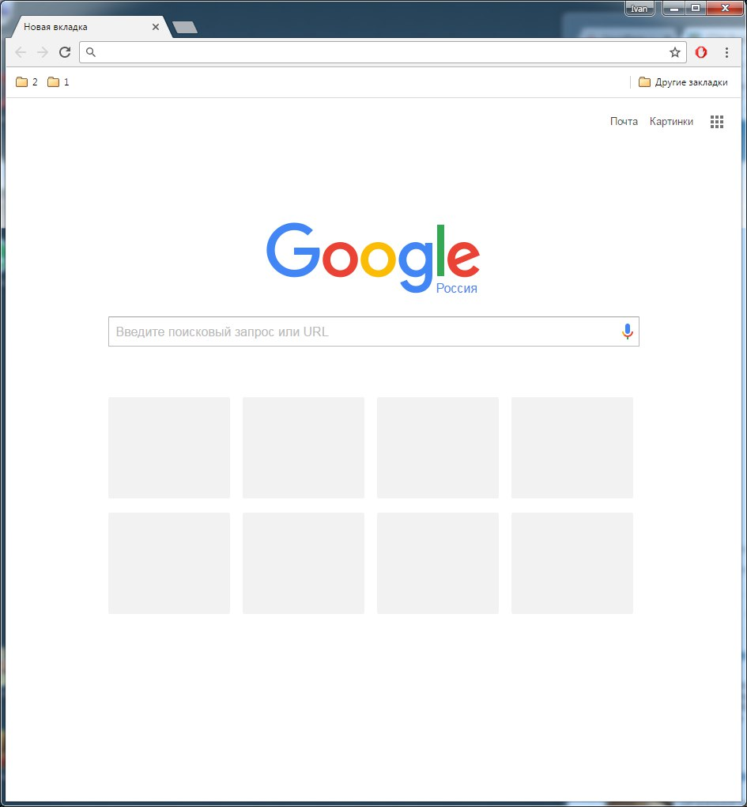

# Задание 0
Селиверстов Иван

- Пример хорошего интерфейса. Возможность как угодно редактировать главную страницу,
создавать папки и так далее.

	

- Пример плохого интерфейса. Нет возможности редактировать главную страницу,
за исключением удаления элементов. Закладки на ней появляются автоматически
после прямых переходов на сайты.

	